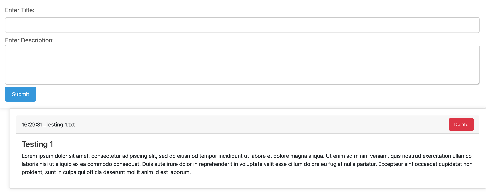

# Simple To-Do List Web Application

This is a simple web application built with Flask for creating and managing to-do list items. Users can add to-do items with a title and description, and the items are displayed on the web page. Users can also delete items from the list.

## Getting Started
- Clone this repository.
- Install Flask and other dependencies using `pip install -r requirements.txt`.
- Run the Flask application using `python app.py`.
- Access the application in your web browser at `http://localhost:5000`.

## Screenshots

## Technologies Used
- Python
- Flask
- HTML
- CSS
- JavaScript
